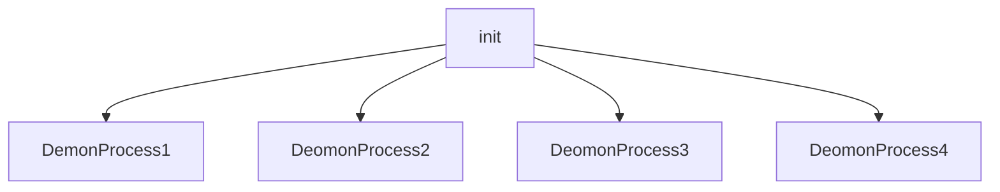
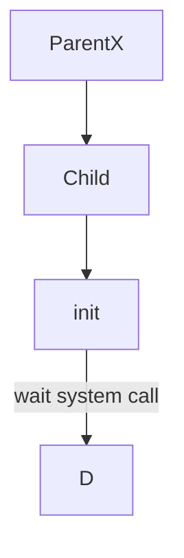
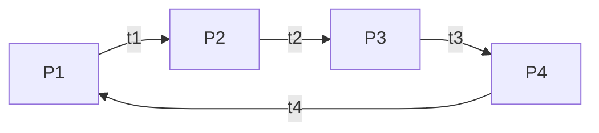

# Processes
Processes are just programs that are running on linux machine. This processes are generally managed by kernel and each process have a **PID**(process id).

## General commands of processes

| command | description | |
| ------------- | ------------- |---------------------- |
| `ps`  |  list current process of shell |  |
| `ps aux`  |  list all process |  |
| `top`  | list all process  |  |

## How process starts
---
General example
---

## How process terminates

### Mother Process

### Demon Process

### Orphan Process

### Zombie Process

# Signals
|  Signal |  Description |
| ------------- | ------------- |
|  `SIGNHUP/HUP/1` |  HangUp |
| `SIGINT/INT/2`  | Interput  |
| `SIGNKILL/KILL/9`  |  Kill | 
|  `SIGSEGV/SEGV/11` | Segmentation fault  |
| `SIGTER/TERM/15`  | Terminate  |
| `SIGSTOP/STOP/19`  |  Stop | 

### Nice & Renice
---
Process cycle in CPU
---

