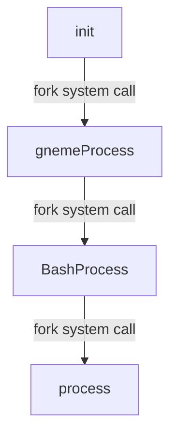
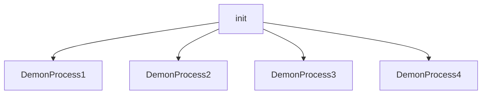
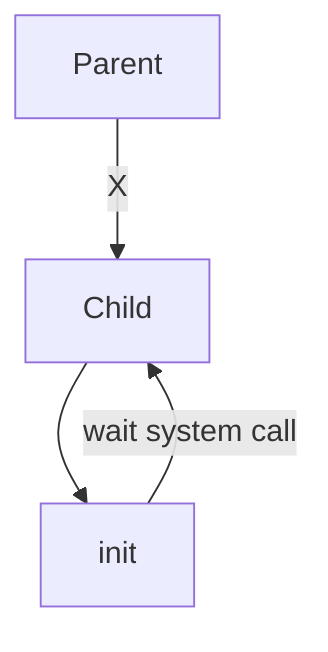

Those who would like to make improvements in the future - You can help us improve notes based on [this](https://www.youtube.com/watch?v=cnbvsWKf-qM&list=PL2kSRH_DmWVZp_cu6MMPWkgYh7GZVFS6i&index=5) video.
# Processes
Processes are just programs that are running on linux machine. Any command that we execute starts a proccess. These processes are generally managed by kernel and each process have a **PID**(process id) which is used to uniquely identify each process. Processes
are terminated when terminal associated with it is closed.

## General commands of processes

| command | description | |
| ------------- | ------------- |---------------------- |
| `ps`  |  list current processes of shell |  |
| `ps aux`  |  list all processes |  |
| `top`  | list all real time processes  |  |

## How process starts

New process in the linux system starts by mechanism know as **Fork System Call**. In this the new process(child) **clone** the **present process**(parent 
process) by requesting the kernel. Kernel decides the resources to the process.


### Mother Process

 Mother Process is the **first process** initiated by the kernel when system **boot up** which has PID of **1**. Mother process is also known as **init** and this process runs on **root** previledge.
 
### Demon Process

Demon processes are the **child process** of mother. These are responsible for keeping the system running.
    


## How process terminates
 Termination of process is done by **exit system call** and **wait system call** . Kernel known whether the process is terminated or not by **termination status**. For the successful process termination status is **0**. Termination process includes the cleaning of resources utilized by the process.
 
### Wait system call
 Parent process should acknowledge the kernel by **wait system call** for completion of termination process of child. The wait system call is used by a parent process to wait for its child process to terminate and obtain its termination status.
 
### Orphan Process
  If parent process dies,then the child process of it is adoped to the **mother**(init) by the kernel for termination of the process. So, that mother can able to acknowlegde the termination process by wait system call. In this case, the child process is known as **orphan process**.



### Zombie Process
 When the child process termination is not acknowledge by the parent ,then the child process is treated as **zombie process** by the kernel.Further,if parent process acknowlegde the zombie process termination then this is known as **reaping**. If reaping didn't occurs then the **wait system call** is done by mother to terminate **zombie process**.

# Signals
 It is a notification to the process that something has happened.

### Common signals

|  Signal |  Description |
| ------------- | ------------- |
|  `SIGHUP/HUP/1` |  HangUp |
| `SIGINT/INT/2`  | Interput  |
| `SIGKILL/KILL/9`  |  Kill | 
|  `SIGSEGV/SEGV/11` | Segmentation fault  |
| `SIGTER/TERM/15`  | Terminate  |
| `SIGSTOP/STOP/19`  |  Stop | 


### Nice & Renice

Processes aren't continously run by the system.They are know in timeslots known as time slice in CPU and as cyclic as shown in below example. So, the process will take almost same time. But, we can prioritize the process by **nice & renice** command. And every process has nice which indicates priority value. If the nice value is less,the system will prioritize more or vice versa.

---
Process cycle in CPU
---

| Command |  Description |
| ------------- | ------------- |
|  `nice -n priorityValue newProcess` | for new process |
|  `renice priorityValue -p processId` | for already exit process |

### Signal Mask

Signal mask is used to block signals but there are some signals like *kill* cann't be blocked.

# States of process

| State of process |  Description |
| ------------- | ------------- |
|  `R` | The process is running |
|  `S` | Interruptable sleep |
|  `D` | Uninterruptable sleep |
|  `Z` | Zombie |
|  `T` | Stopped |

## Process can be run in two ways
1. Foreground Process
   
   Whenever a process starts, it runs in the foreground by default, receives input from the keyboard, and sends output to the screen. For instance, we can execute the following command:
   ```
   echo "hello world!"
   ```
   What if we execute **cat** command only:
   ```
   $ cat
   ```
   This command is  still executing and waiting for further input. No other process can be started since this process is still under execution.  
3. Background Process

   It operates in the background, only engaging when keyboard input is needed. This enables parallel execution of tasks without waiting for prior processes to finish. We can run a  process in the background by adding **&** at the end of a command.
   ```
   $ cat &
   ```
   We can see all the background processes with the following command
   ```
   $ jobs
   ```
   We can also bring the background process to the foreground
   ```
   $ fg %[job id]
   ```
   we can also kill background process
   ```
   $ kill %[job id]
   ```
   

